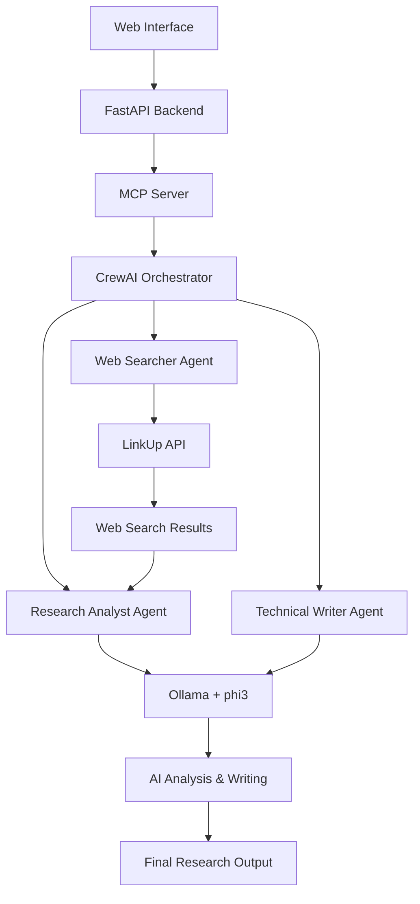

# 🤖 MCP Multi-Agent Deep Researcher

[](https://python.org)
[](https://python-poetry.org/)
[](https://fastapi.tiangolo.com/)
[](https://ollama.ai/)
[](LICENSE)

A powerful multi-agent research system built on the **Model Context Protocol (MCP)**, using **CrewAI** for agent orchestration, **LinkUp** for deep web search, and **phi3** model (via Ollama) for local AI processing. Features both API access and a beautiful web interface for easy research tasks.

## 🌟 Features

- 🧠 **Multi-Agent System**: Three specialized AI agents working together
  - **Web Searcher**: Deep web search using LinkUp API
  - **Research Analyst**: Information synthesis and verification  
  - **Technical Writer**: Clear, structured content creation
- 🌐 **Beautiful Web Interface**: Modern, responsive frontend for easy interaction
- 🔌 **API Access**: RESTful API with FastAPI and automatic documentation
- 🏠 **Local AI Processing**: Uses Ollama with phi3 model - no external AI API needed
- 📡 **MCP Protocol**: Full Model Context Protocol compliance for integration
- 🚀 **One-Command Launch**: Start everything with a single command

## 🎯 Quick Start

**Get started in 3 simple steps:**

```bash
# 1. Clone the repository
git clone https://github.com/YOUR_USERNAME/MCP-Multi-Agent-Deep-Researcher.git
cd MCP-Multi-Agent-Deep-Researcher

# 2. Run the setup script
python3 setup.py

# 3. Launch everything!
python3 launcher.py
```

That's it! The system will automatically open in your browser at `http://localhost:3000/frontend.html`

## 📸 Screenshots

### Web Interface


### API Documentation  


## 🏗️ Architecture

## Architecture

The system implements a three-agent workflow:

1. **Web Searcher**: Uses LinkUp API to find relevant information from multiple sources
2. **Research Analyst**: Synthesizes and verifies the information, focusing on depth and clarity
3. **Technical Writer**: Produces a clear, comprehensive markdown answer



## 📋 Prerequisites

- **Python 3.10+** 
- **[Poetry](https://python-poetry.org/)** for dependency management
- **[Ollama](https://ollama.ai/)** for local AI processing
- **LinkUp API Key** (get free tier at [LinkUp.so](https://linkup.so/))

## 🚀 Installation & Setup

### Option 1: Automated Setup (Recommended)

```bash
# Clone the repository
git clone https://github.com/YOUR_USERNAME/MCP-Multi-Agent-Deep-Researcher.git
cd MCP-Multi-Agent-Deep-Researcher

# Run automated setup (checks dependencies, installs packages, configures environment)
python3 setup.py

# Launch the application (starts both frontend and backend)
python3 launcher.py
```

### Option 2: Manual Setup

<details>
<summary>Click to expand manual setup instructions</summary>

#### 1. Install Dependencies

```bash
# Install Poetry (if not already installed)
curl -sSL https://install.python-poetry.org | python3 -

# Install project dependencies
poetry install
```

#### 2. Install & Configure Ollama

```bash
# Install Ollama (visit https://ollama.ai/ for OS-specific instructions)
# On macOS:
brew install ollama

# Start Ollama service
ollama serve

# Pull the phi3 model (in a new terminal)
ollama pull phi3:latest

# Verify installation
ollama list
```

#### 3. Configure Environment

```bash
# Copy environment template
cp .env.example .env

# Edit .env file and add your LinkUp API key
nano .env
```

Required environment variables:
```env
LINKUP_API_KEY=your_linkup_api_key_here
OLLAMA_BASE_URL=http://localhost:11434
MODEL_NAME=phi3:latest
```

#### 4. Start the Services

```bash
# Option A: Use the launcher (recommended)
python3 launcher.py

# Option B: Start services manually
# Terminal 1 - Backend API
poetry run python Multi-Agent-deep-researcher-mcp-windows-linux/http_server.py

# Terminal 2 - Frontend
python3 -m http.server 3000

# Terminal 3 - MCP Server (optional, for MCP client integration)
poetry run python Multi-Agent-deep-researcher-mcp-windows-linux/server.py
```

</details>

### 🔑 Get Your LinkUp API Key

1. Visit [LinkUp.so](https://linkup.so/)
2. Sign up for a free account
3. Get your API key from the dashboard
4. Add it to your `.env` file

## 🎮 Usage

### Web Interface (Easiest)

1. **Launch the application**: `python3 launcher.py`
2. **Open your browser** to `http://localhost:3000/frontend.html` (opens automatically)
3. **Enter your research query** or try the example queries
4. **Choose your mode**:
   - 🔍 **Quick Search**: Fast web search with LinkUp API
   - 🧠 **Full Research**: Complete multi-agent analysis workflow
5. **View results** with formatted output, copy/download options

### API Access

#### Quick Search
```bash
curl -X POST http://localhost:8080/search \
  -H "Content-Type: application/json" \
  -d '{"query": "latest AI trends 2024"}'
```

#### Full Research  
```bash
curl -X POST http://localhost:8080/research \
  -H "Content-Type: application/json" \
  -d '{"query": "comprehensive analysis of quantum computing applications"}'
```

#### Health Check
```bash
curl http://localhost:8080/health
```

### MCP Client Integration

For integration with MCP-compatible clients, add this configuration:

```json
{
  "mcpServers": {
    "crew_research": {
      "command": "poetry",
      "args": ["run", "python", "Multi-Agent-deep-researcher-mcp-windows-linux/server.py"],
      "env": {
        "LINKUP_API_KEY": "your_linkup_api_key_here"
      }
    }
  }
}
```

### Available Endpoints

| Endpoint | Method | Description |
|----------|--------|-------------|
| `/health` | GET | Health check |
| `/search` | POST | Quick web search |
| `/research` | POST | Full multi-agent research |
| `/docs` | GET | Interactive API documentation |

## 📁 Project Structure

```
MCP-Multi-Agent-Deep-Researcher/
├── 🚀 launcher.py                    # Single-command launcher
├── 🌐 frontend.html                  # Web interface  
├── ⚙️ setup.py                       # Automated setup script
├── 📋 start.sh                       # Shell launcher script
├── 📖 QUICKSTART.md                  # Quick start guide
├── 🔧 Makefile                       # Development commands
├── 📦 pyproject.toml                 # Poetry dependencies
├── 🔐 .env.example                   # Environment template
├── ⚙️ mcp.config.json                # MCP client configuration
└── Multi-Agent-deep-researcher-mcp-windows-linux/
    ├── 🖥️ server.py                  # MCP protocol server
    ├── 🌐 http_server.py             # FastAPI REST server  
    ├── 🧪 test_research.py           # Testing utilities
    └── agents/                       # Multi-agent system
        ├── 🤖 research_crew.py       # CrewAI orchestration
        └── tools/                    # Agent tools
            ├── 🔍 linkup_search.py   # Web search integration
            └── 🧠 ollama_tool.py     # Local AI integration
```

## 🎯 Example Queries

Try these sample research queries:

### Quick Search Examples
- "What are the latest AI trends in 2024?"
- "Current developments in renewable energy"
- "Recent breakthroughs in quantum computing"

### Full Research Examples  
- "Comprehensive analysis of the environmental impact of cryptocurrency mining"
- "How does quantum computing work and what are its real-world applications?"
- "The future of autonomous vehicles: technology, challenges, and timeline"
- "Impact of artificial intelligence on healthcare: opportunities and risks"

## Agentic Workflow

The system uses CrewAI to orchestrate three specialized agents:

### 1. Web Searcher Agent
- **Role**: Web Research Specialist
- **Goal**: Find comprehensive and relevant information using LinkUp API
- **Tools**: LinkUp Search Tool
- **Output**: Detailed summary of web search results with sources

### 2. Research Analyst Agent
- **Role**: Research Analyst
- **Goal**: Analyze and synthesize information to provide comprehensive insights
- **Input**: Web search results
- **Output**: Structured analysis with key insights and verified information

### 3. Technical Writer Agent
- **Role**: Technical Writer
- **Goal**: Create clear, comprehensive, and well-structured written content
- **Input**: Research analysis
- **Output**: Comprehensive, well-formatted markdown document

## Configuration

### Environment Variables

- `LINKUP_API_KEY`: Your LinkUp API key for web search functionality
- `OLLAMA_BASE_URL`: Base URL for Ollama API (default: http://localhost:11434)
- `MODEL_NAME`: Ollama model to use (default: phi3)

### Customizing Agents

You can customize the agents by modifying `agents/research_crew.py`:

- Adjust agent roles, goals, and backstories
- Modify task descriptions and expected outputs
- Add or remove tools for specific agents
- Change the process flow (sequential, hierarchical, etc.)

## 🐛 Troubleshooting

### Common Issues & Solutions

<details>
<summary><strong>🚫 "Address already in use" error</strong></summary>

```bash
# Kill existing processes
pkill -f "python.*http_server"
pkill -f "http.server"

# Or restart with different ports
python3 launcher.py
```
</details>

<details>
<summary><strong>🔗 Ollama connection failed</strong></summary>

```bash
# Check if Ollama is running
ollama serve

# Verify model is available
ollama list

# Pull model if missing
ollama pull phi3:latest

# Check Ollama is accessible
curl http://localhost:11434/api/tags
```
</details>

<details>
<summary><strong>🔑 LinkUp API errors</strong></summary>

1. Verify API key in `.env` file
2. Check LinkUp dashboard for usage limits
3. Test API key:
```bash
curl -H "Authorization: Bearer YOUR_API_KEY" \
     -H "Content-Type: application/json" \
     -d '{"q": "test"}' \
     https://api.linkup.so/v1/search
```
</details>

<details>
<summary><strong>🧩 Dependencies issues</strong></summary>

```bash
# Reinstall dependencies
poetry install --no-cache

# Or use pip fallback
pip install -r requirements.txt

# Check Python version
python3 --version  # Should be 3.10+
```
</details>

<details>
<summary><strong>🌐 CORS/Frontend issues</strong></summary>

- Make sure both servers are running
- Check browser console for errors
- Try accessing backend directly: `http://localhost:8080/health`
- Clear browser cache and reload
</details>

### Getting Help

1. **Check logs**: The launcher shows detailed logs for both servers
2. **Run diagnostics**: `python3 setup.py` to verify setup
3. **Test components**: `python3 simple_test.py` for individual tests
4. **Enable debug mode**: Set `logging.basicConfig(level=logging.DEBUG)` in server files

## 🛠️ Development

### Quick Commands

```bash
# Start everything
make start          # or make launch, make demo

# Development setup
make dev-setup      # Install deps + setup + verify

# Run tests
make test           # Basic functionality test
make quick-test     # Quick search test  

# Maintenance
make clean          # Clean cache files
make verify         # Verify installation
```

### Adding Custom Agents

1. **Create new agent** in `agents/research_crew.py`:
```python
custom_agent = Agent(
    role='Custom Specialist',
    goal='Your specific goal',
    backstory='Agent background',
    tools=[your_tools]
)
```

2. **Add to crew workflow**:
```python
custom_task = Task(
    description="Task description",
    agent=custom_agent,
    expected_output="Expected result format"
)
```

### Adding New Tools

1. **Create tool file** in `agents/tools/`:
```python
class CustomTool(BaseTool):
    name = "Custom Tool"
    description = "Tool description"
    
    def _run(self, query: str) -> str:
        # Tool implementation
        return result
```

2. **Register with agents** in `research_crew.py`

### Environment Configuration

| Variable | Description | Default |
|----------|-------------|---------|
| `LINKUP_API_KEY` | LinkUp search API key | Required |
| `OLLAMA_BASE_URL` | Ollama server URL | `http://localhost:11434` |
| `MODEL_NAME` | Ollama model name | `phi3:latest` |
| `OPENAI_API_KEY` | Set to `ollama` for local use | `ollama` |
| `OPENAI_API_BASE` | Ollama OpenAI-compatible endpoint | `http://localhost:11434/v1` |

## 🤝 Contributing

We welcome contributions! Here's how to get started:

### Development Setup
```bash
# Fork and clone the repo
git clone https://github.com/YOUR_USERNAME/MCP-Multi-Agent-Deep-Researcher.git
cd MCP-Multi-Agent-Deep-Researcher

# Install development dependencies  
poetry install --with dev

# Run pre-commit setup
pre-commit install
```

### Contribution Guidelines
1. 🍴 Fork the repository
2. 🌿 Create a feature branch: `git checkout -b feature/amazing-feature`
3. ✨ Make your changes with clear, commented code
4. 🧪 Add tests for new functionality
5. ✅ Run tests: `make test`
6. 📝 Update documentation as needed
7. 🚀 Submit a pull request

### Areas for Contribution
- 🔧 New agent tools and integrations
- 🎨 Frontend UI/UX improvements  
- 📚 Documentation and examples
- 🧪 Test coverage expansion
- 🐛 Bug fixes and performance improvements
- 🌍 Internationalization

## 📊 Performance & Scaling

- **Quick Search**: ~2-5 seconds (LinkUp API dependent)
- **Full Research**: ~30-60 seconds (depends on query complexity)
- **Concurrent Users**: Supports multiple simultaneous requests
- **Memory Usage**: ~500MB-1GB (Ollama model dependent)
- **Disk Space**: ~3GB (including phi3 model)

## 🔒 Security & Privacy

- ✅ **Local AI Processing**: No data sent to external AI services
- ✅ **API Key Security**: LinkUp API key stored locally only
- ✅ **No Data Persistence**: Research queries not stored by default
- ✅ **CORS Protection**: Configurable origin restrictions
- ⚠️ **Web Search**: Queries sent to LinkUp API (see their privacy policy)

## 📄 License

This project is licensed under the **MIT License** - see the [LICENSE](LICENSE) file for details.

## 🙏 Acknowledgments

Built with amazing open-source technologies:

- 🤖 **[CrewAI](https://crewai.com/)** - Multi-agent orchestration framework
- 🔍 **[LinkUp](https://linkup.so/)** - Deep web search API
- 🧠 **[Ollama](https://ollama.ai/)** - Local LLM serving platform
- ⚡ **[FastAPI](https://fastapi.tiangolo.com/)** - Modern Python web framework
- 🎭 **[Model Context Protocol](https://modelcontextprotocol.io/)** - AI integration standard
- 📦 **[Poetry](https://python-poetry.org/)** - Python dependency management

## ⭐ Star History

[](https://star-history.com/#YOUR_USERNAME/MCP-Multi-Agent-Deep-Researcher&Date)

---

<div align="center">

**Made with ❤️ for the AI research community**

[🌟 Star this repo](https://github.com/YOUR_USERNAME/MCP-Multi-Agent-Deep-Researcher) • [🐛 Report Bug](https://github.com/YOUR_USERNAME/MCP-Multi-Agent-Deep-Researcher/issues) • [💡 Request Feature](https://github.com/YOUR_USERNAME/MCP-Multi-Agent-Deep-Researcher/issues)

</div>